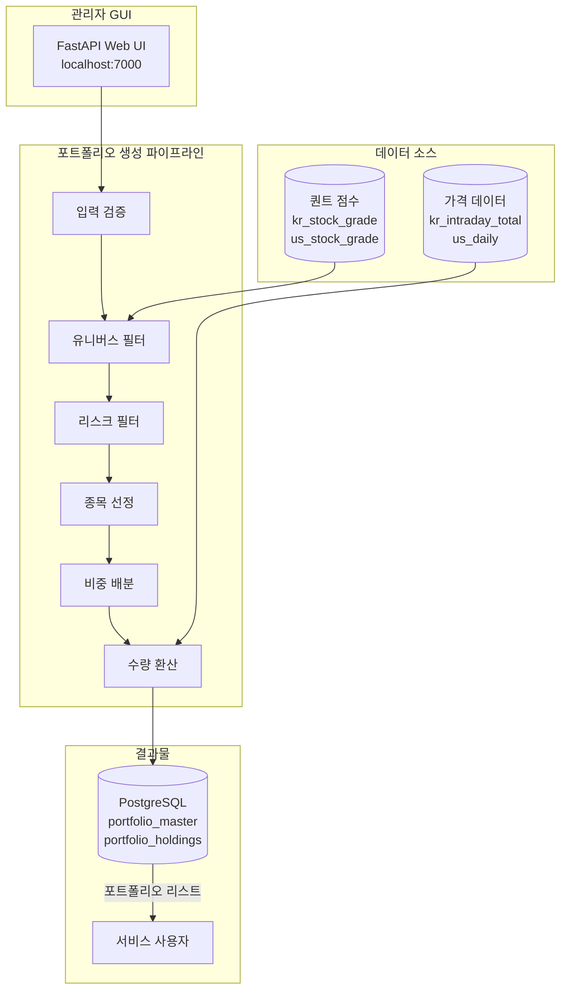
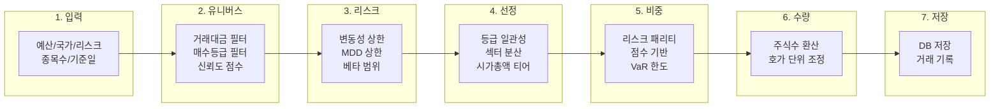

# 떡상 - Portfolio Engine


**관리자용 포트폴리오 생성 & 리밸런싱 엔진**

> 이 프로젝트는 현재 개발 중입니다. 일부 기능이 미완성이거나 변경될 수 있습니다.

---

## 목차

- [이 저장소의 역할](#이-저장소의-역할)
- [프로젝트 구조](#프로젝트-구조)
- [개발환경 및 사용기술](#개발환경-및-사용기술)
- [시스템 아키텍처](#시스템-아키텍처)
- [포트폴리오 생성 파이프라인](#포트폴리오-생성-파이프라인)
- [기술적 특징](#기술적-특징)
- [폴더 구조](#폴더-구조)
- [라이선스](#라이선스)

---

## 이 저장소의 역할

전체 프로젝트 중 **포트폴리오 생성 & 리밸런싱 엔진** 컴포넌트를 담당합니다.

| 기능 | 설명 |
|------|------|
| **포트폴리오 생성** | 퀀트 점수 기반 자동 종목 선정 및 비중 배분 |
| **리스크 관리** | VaR 한도, 섹터 분산, 시가총액 티어링 적용 |
| **리밸런싱** | 주기적 포트폴리오 재조정 (개발 중) |
| **관리자 GUI** | 로컬 웹 인터페이스로 포트폴리오 생성/조회 |

> **관리자 전용 프로그램**: 생성된 포트폴리오 리스트와 리밸런싱 결과물만 서비스 사용자에게 제공됩니다.

## 프로젝트 구조

| 폴더 | 설명 |
|------|------|
| `alpha_front/client/` | Frontend (UI/UX) |
| `alpha_front/api/` | Frontend <-> Backend API 통신 |
| `alpha/data/` | 데이터 자동 수집 & 지표 계산 |
| `alpha/chat/` | 주식 투자 전략 전문 LLM |
| `alpha/quant/` | 멀티팩터 퀀트 분석 엔진 |
| `alpha/stock_agents/` | 종목 투자 전략 Multi-Agent AI |
| **`alpha/portfolio/`** | **📍 포트폴리오 생성 & 리밸런싱 엔진 (현재 저장소)** |

## 개발환경 및 사용기술

| 구분 | 기술 |
|------|------|
| **언어** | Python 3.11+ |
| **웹 프레임워크** | FastAPI |
| **템플릿 엔진** | Jinja2 |
| **데이터베이스** | PostgreSQL (asyncpg) |
| **수치 연산** | NumPy |
| **검증** | Pydantic |

### 지원 시장

| 시장 | 설명 |
|------|------|
| KR | 한국 (KOSPI, KOSDAQ) |
| US | 미국 (NASDAQ, NYSE) |
| MIXED | 한국 + 미국 혼합 |

---

## 시스템 아키텍처



---

## 포트폴리오 생성 파이프라인

### 7단계 파이프라인



### 단계별 상세

| 단계 | 모듈 | 설명 |
|------|------|------|
| 1 | `portfolio_input.py` | 입력 검증 및 제약조건 생성 |
| 2 | `portfolio_universe.py` | 유니버스 필터링 (거래대금, 등급, 신뢰도) |
| 3 | `portfolio_risk_filter.py` | 리스크 필터링 (변동성, MDD, 베타) |
| 4 | `portfolio_selector.py` | 종목 선정 (등급 일관성, 분산) |
| 5 | `portfolio_weight.py` | 비중 배분 (리스크 패리티, VaR) |
| 6 | `portfolio_quantity.py` | 수량 환산 (호가 단위) |
| 7 | `portfolio_db.py` | DB 저장 (master, holdings, transactions) |

---

## 기술적 특징

### 리스크 레벨별 제약조건

| 설정 | 안정형 | 균형형 | 공격형 |
|------|--------|--------|--------|
| 변동성 상한 | 40% | 60% | 무제한 |
| MDD 상한 | -20% | -30% | 무제한 |
| 베타 범위 | 0.5~1.2 | 0.3~1.5 | 무제한 |
| 종목당 최대 비중 | 15% | 20% | 50% |
| 섹터당 최대 비중 | 30% | 40% | 50% |

### 종목 선정 점수 (Selection Score)

```
Selection Score = α × Final Score
                + β × Conviction Score
                + γ × Sector Rotation Score
                + δ × Grade Consistency Score
                + ε × Momentum Return Score
```

<details>
<summary><b>가중치 설정</b></summary>

| 리스크 레벨 | α (종합) | β (확신도) | γ (섹터) | δ (일관성) | ε (모멘텀) |
|-------------|----------|------------|----------|------------|------------|
| 안정형 | 0.40 | 0.30 | 0.10 | 0.20 | 0.05 |
| 균형형 | 0.45 | 0.25 | 0.15 | 0.15 | 0.10 |
| 공격형 | 0.50 | 0.15 | 0.25 | 0.10 | 0.20 |

**US 시장 특화**: 모멘텀 가중치 강화, 섹터 로테이션 약화

</details>

### 등급 일관성 필터

- 최소 5일 연속 매수등급 유지 필수
- 매수등급: 강력 매수, 매수, 매수 고려
- 일관성 점수: 연속일수 + 매수등급 비율 반영

### 비중 배분 (Risk Parity Blend)

```
Final Weight = blend × Risk Parity Weight + (1-blend) × Score Weight
```

| 리스크 레벨 | 리스크 패리티 비율 | 점수 기반 비율 |
|-------------|-------------------|----------------|
| 안정형 | 70% | 30% |
| 균형형 | 50% | 50% |
| 공격형 | 30% | 70% |

### VaR 한도 관리

| 리스크 레벨 | VaR 95% 한도 (일간) |
|-------------|---------------------|
| 안정형 | 2.0% |
| 균형형 | 3.0% |
| 공격형 | 5.0% |

- VaR 초과 시 고변동성 종목 비중 자동 감소
- 저변동성 종목으로 비중 재배분

### 분산 투자

<details>
<summary><b>섹터 분산</b></summary>

| 리스크 레벨 | 최소 섹터 수 | 섹터당 최대 종목 |
|-------------|-------------|------------------|
| 안정형 | 5개 | 2종목 |
| 균형형 | 4개 | 3종목 |
| 공격형 | 3개 | 4종목 |

</details>

<details>
<summary><b>시가총액 티어링</b></summary>

| 리스크 레벨 | 대형주 | 중형주 | 소형주 |
|-------------|--------|--------|--------|
| 안정형 | 60% | 30% | 10% |
| 균형형 | 40% | 40% | 20% |
| 공격형 | 20% | 40% | 40% |

- 대형주: > $7B (약 10조원)
- 중형주: $700M ~ $7B (약 1조~10조원)
- 소형주: < $700M (약 1조원 미만)

</details>

<details>
<summary><b>상관관계 기반 분산</b></summary>

동일 섹터 내 고비중 종목 쌍의 합산 비중 제한:

| 리스크 레벨 | 섹터 내 쌍당 최대 비중 |
|-------------|----------------------|
| 안정형 | 20% |
| 균형형 | 30% |
| 공격형 | 40% |

</details>

---

## 폴더 구조

```
portfolio/
├── app.py                    # FastAPI 웹 서버 (관리자 GUI)
├── config.py                 # 설정 및 제약조건 상수
├── models.py                 # Pydantic 모델 정의
├── requirements.txt          # 의존성 패키지
│
├── create/                   # 포트폴리오 생성
│   ├── portfolio_generator.py    # 메인 오케스트레이터
│   └── portfolio_input.py        # 입력 처리 및 검증
│
├── core/                     # 핵심 로직
│   ├── portfolio_universe.py     # 유니버스 필터링
│   ├── portfolio_risk_filter.py  # 리스크 필터링
│   ├── portfolio_selector.py     # 종목 선정
│   ├── portfolio_weight.py       # 비중 배분
│   └── portfolio_quantity.py     # 수량 환산
│
├── db/                       # 데이터베이스
│   ├── db_manager.py             # DB 연결 관리
│   └── portfolio_db.py           # 포트폴리오 저장
│
├── rebalancing/              # 리밸런싱 (개발 중)
│   └── __init__.py
│
├── templates/                # Jinja2 템플릿 (관리자 GUI)
│   ├── create.html
│   ├── list.html
│   └── detail.html
│
└── static/                   # 정적 파일 (CSS, JS)
```

---

## 라이선스

**All Rights Reserved**

이 프로젝트의 모든 권리는 저작권자에게 있습니다.

- 본 코드의 복제, 배포, 수정, 상업적/비상업적 사용을 금지합니다.
- 채용 검토 목적의 열람만 허용됩니다.
- 무단 사용 시 법적 책임을 물을 수 있습니다.

문의: 저장소 소유자에게 연락해 주세요.
